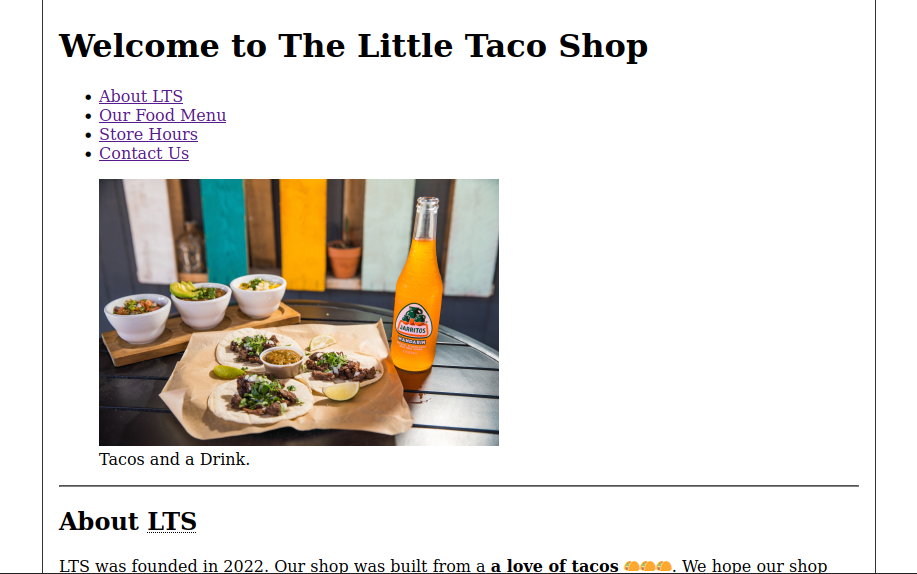
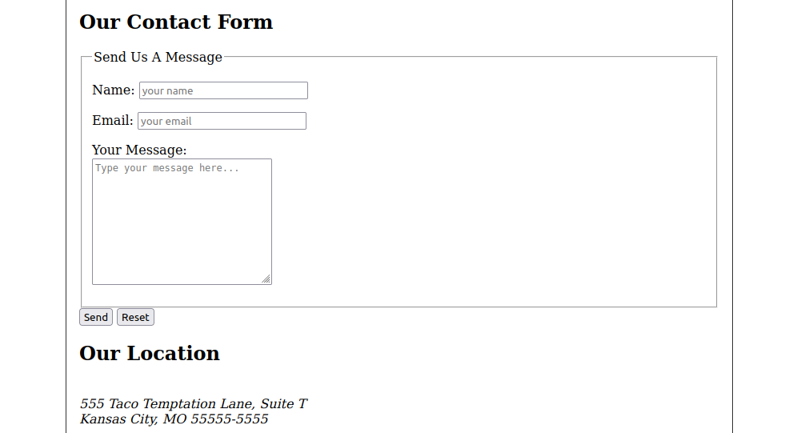
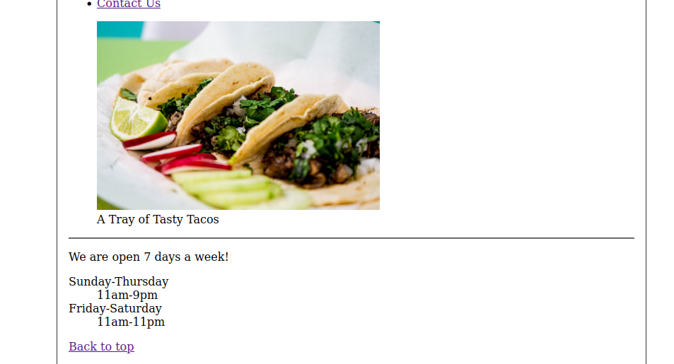

# HTML Course from freeCodeCamp.org 

This repository will contain code of the exercises relate to the [**Learn HTML - Full Tutorial for Beginners (2022)**](https://www.youtube.com/watch?v=kUMe1FH4CHE) course.

## Chapter 3 - Text Basics

## Chapter 4 - List Types

## Chapter 5 - Links

## Chapter 6 - Images

## Chapter 7 - Semantics

## Chapter 8 - Tables

## Chapter 9 - Forms & Inputs

## Final Project: The Little Taco Shop

